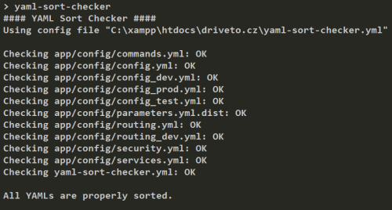

# YAML file sort checker 

  

This library helps you to keep YAML file sorted to prevent unnecessary merge conflicts.

> Check out the article I've written about the tool: [Keep your YAML files sorted with YAML sort checker](https://blog.martinhujer.cz/yaml-sort-checker/)

Typical example is when two developers register a new service in `services.yml`. If they both add it to the end, it unevitably will lead to a merge conflict. However, when the services are alphabetically sorted, the probability of merge conflict is much lower (because the added services probably won't clash).

Usage
----
1. Install the latest version with `composer require --dev mhujer/yaml-sort-checker`
2. Create a configuration file `yaml-sort-checker.yml` in project root with list of the files for checking, see the  [example configuration for Symfony app](/docs/symfony-config/yaml-sort-checker.yml).
3. Run `vendor/bin/yaml-sort-checker` (depends on where you have your Composer bin directory)
4. Exclude the yaml keys you don't want to sort - e.g. it makes more sense to have them unsorted (see the [example configuration](/docs/symfony-config/yaml-sort-checker.yml))

PHPStorm Integration
---------------------
Until [WI-35271](https://youtrack.jetbrains.com/issue/WI-35271) is resolved, YAML sort checker can be integrated into PHPStorm by using File Watcher feature.

1. Open Settings -> Tools -> File Watchers
2. Add new
3. File type: `YAML`
4. Program: `PATH_TO_YOUR_PROJECT\vendor\bin\yaml-sort-checker.bat`
5. Open *Other Options* and enter: `$ProjectFileDir$` to *Working directory*
6. Now, when you are editing YAML files, it will run the checker on every file save and will open the console if there are errors

Requirements
------------
Works with PHP 7.1 or higher.

Submitting bugs and feature requests
------------------------------------
Bugs and feature request are tracked on [GitHub](https://github.com/mhujer/yaml-sort-checker/issues)

Author
------
[Martin Hujer](https://www.martinhujer.cz) 

Changelog
----------

## 1.1.0 (2018-03-20)
- [#6](https://github.com/mhujer/yaml-sort-checker/pull/6) Symfony 4 compatibility (thanks *@OndraM*)

## 1.0.0 (2017-01-28)
- initial release
